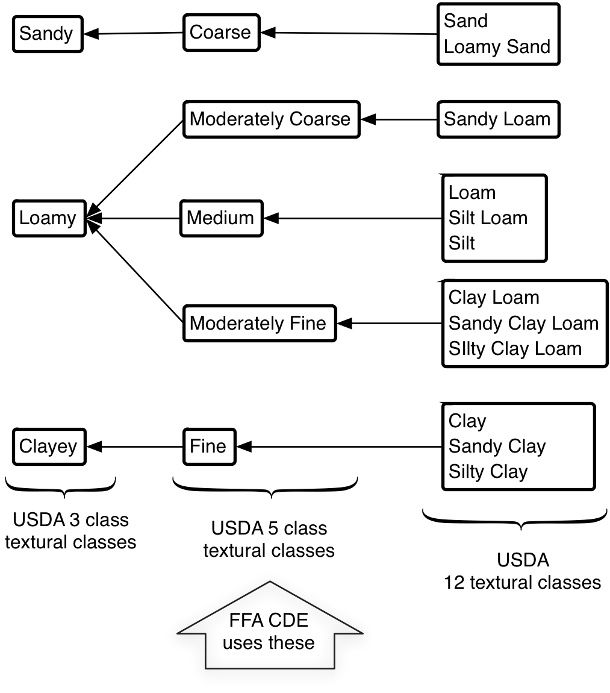

# Copyright

The Soil Physical Properties by Donald G. McGahan is licensed under a [Creative Commons Attribution-NonCommercial-ShareAlike 4.0 International (CC BY-NC-SA 4.0)](https://creativecommons.org/licenses/by-nc-sa/4.0/)

# Introduction

Descriptions of the physical properties of soil include size separates, organization of size separates, density, voids or porosity, color, reaction, effervescence and consistence. These are properties that can be seen, felt, and tasted.

In this treatment of physical properties of soil, examples of categorizing the information is presented. The categorical classes presented are those used in practice by the United Stated Department of Agriculture (USDA) Soil Survey Division Staff when describing soil.

These classes are part of the data that is collated and parsed to place soil into a natural classification called ***Soil Taxonomy***. Other classifications that are more properly differentiated as technical classification systems as opposed to the natural classification system of Soil Taxonomy. Therefore, the underlying measurements introduced in this treatment and the organizing of the measurements into classes represent the data that is used to convey information about how the soil exists and how it might be leveraged for a plethora of uses.

Below each of the properties introduced might easily be expanded upon in a more complete treatment of there own. The goal of this presentation is to present each property in a manor that allows sufficient depth so as to gird the learner in preparation for leveraging information about soil and soils service to a number of ecological processes and uses.

# Organic Soil

Soil solids can be mineral or organic in nature. A soil that consists of primarily accumulated plant material of various degrees of decomposition are separated from soils derived from dominantly mineral materials. The use of the term **organic soil** in this text is that defined by the U.S. Department of Agriculture. To be considered an organic soil:

1.  Soil that is never saturated with water for more than a few days must contain more than 20 % organic carbon.

2.  If the soil is saturated for periods longer than a few days, it is organic if it contains the following:

    -   At least 12 % organic carbon if the soil has not clay,

    -   At least 18 % percent organic carbon if the soil has 60 percent or more clay, or

    -   If it contains a proportional amount of organic carbon for intermediate amounts of clay.

The percentages are determined on a mass basis. A conversion factor of 1.72 is commonly used to convert organic carbon to organic matter. This conversion factor assumes organic matter contains 58 % organic carbon. However this can vary with the type of organic matter, soil type and soil depth. Conversion factors can be as high as 2.50, especially for subsoils.

Most soils have some organic carbon but are below the levels necessary to attain the organic soil name. The inorganic or mineral fraction of the soil are measured and classified based on size.

# Classifying Mineral Size Separates

Separates are the individual particles that together with organics, salts, and evaporates comprise a soil. We size them by placing them together in groupings that have a range in size with an upper and lower effective spherical diameter. The choice for the range in size is dictated by properties that one ‘size range’ exhibits, that is different than other size ranges. Often these can be grouped for particular purposes. The groupings once formalized are termed ‘classes.’ The term fraction is used to connote part of a whole.

First, the standard is determination based on only the mineral fraction. Organics, salts, and evaporites are not included as part of the whole.

Second, we group the separates of the “whole” soil into two classes, the coarse fraction (CF) and the fine-earth fraction. The coarse fraction consists of the particles greater than 2 mm in diameter and the fine-earth fraction consist of particles equal to and less than 2 mm.

Both the coarse fraction and fine-earth fraction are further divided, again, on the basis of size. The fine-earth fraction is divided first into three size separates: sand, silt, and clay.

Coarse Fraction are separates greater in diameter than 2 mm.

Fine-Earth Fraction are separates less than or equal to 2 mm.

Coarse fragments, or the coarse fraction, are important to consider because they occupy space in the soil, but contribute little or no voids (water and air storage) and chemical reactivity (nutrient storage). Thus, coarse fragments reduce the soil volume available to hold water and nutrients. Coarse fragments may also make cultivation difficult.

## Soil Texture

Soil texture refers to the proportion groupings of size separates in the inorganic soil fine earth fraction (< 2 mm in diameter). There are generally three groupings with further divisions of the three to achieve more refined interpretive relevance. Texture can generally not be changed, except at great expense (example: adding sand to your garden). The three groupings of the fine earth fraction are sand, silt, and clay.

The sands are the separates between 0.05 mm–2 mm.

The sand size separates are further classed into five size classes. *Very Course Sand* separates are from 2 mm–1 mm diameter. *Course Sand* separates are from 1 mm–0.5 mm diameter. *Medium Sand* separates is from 0.5 mm–0.25 mm diameter. *Fine Sand* separates is from 0.25 mm–0.10 mm diameter. *Very Fine Sand* separates is from 0.10 mm–0.05 mm diameter.

Silt are separates are between the diameters of 0.002 mm–0.05 mm or 2 μm–50 μm where 1000 μm are in 1 mm.

Clay are separates with diameters of ≤ 0.002 mm or 2 μm.

## Textural Triangle

A Gibbs triangle, commonly referred to as a textural triangle, is a ternary diagram that relates the relationship between the sand, silt, and clay mass proportions and helps place the relationship of these size separates into a **Textural Class**. The twelve soil textural class system is presented in <a href="fig:TexturalTriangle">Figure </a>.

Sand, Loamy Sand, Sandy Loam, Sandy Clay Loam, Silt, Silt Loam, Silty Clay Loam, Loam, Clay Loam, Clay, Silty Clay, and Sandy Clay.

It is important to note that the sand, silt, and clay mass proportions represented as a percent of the fine earth fraction add up to 100 percent. Organic matter and course fraction is not included when determining the textural class.

Sand% + Silt% + Clay% = 100%

<figure id="fig:TexturalTriangle">
  
  <figcaption>Figure 1. Gibbs Triangle or commonly called a Textural Triangle.</figcaption>
</figure>

Loam is a soil textural class in which the sand, silt and clay fractions have a similar influence on soil properties, but are not in equal proportions.

Some of the textural classes can be further subdivided. Such a refinement is usually based upon sand distribution e.g. Loamy **Very Fine** Sand.

Each of these twelve textural class names may have a coarse fraction modifier added when the coarse fraction exceeds 15% of the soil horizons volume. Note that the assignment to one of the textural classes on a mass basis but the coarse fraction contribution is determined on a volume basis.

The Course Fraction is divided into four (4) classes: *gravel*, *cobble*, *stone*, and *boulder* (Table <a href="#tab:coarsefractionsizenames" data-reference-type="ref" data-reference="tab:coarsefractionsizenames">3</a>).

The implications of course fraction is that the course fraction does not participate in water retention and can have an impact on tillage operations.

If two or more coarse fraction sizes exist, the entire volume of the course fraction is used for the modifier.

The largest size fraction is named, unless a smaller fraction is more than twice the volume of the larger size fraction and then that smaller fraction modifier is used as the modifier.

<figure id="fig:TextureClass12-5-3">

<figcation>Figure 2. Diagram relating the twelve, five and three  Textural Classes. The High School organization FFA uses the USDA five class textural classes categorical system for their Carrier Development Events. All three systems are used a in classifying and decimating information about where soils live their properties and services they provide.</figcaption>
</figure>

## Determination of soil texture

The field method of determining textural class is the “feel method” where sand feels gritty, silt feels smooth or floury, and clay feels sticky. And the subsequently determined proportions are classed and as “apparent texture”.

Professional practitioners aim to determine the apparent textural class of the twelve category textural class system as the five and three category systems can be derived and employed as necessary. Figure <a href="#fig:TextureByFeelFlowChart12" data-reference-type="ref" data-reference="fig:TextureByFeelFlowChart12">[fig:TextureByFeelFlowChart12]</a> provides a decision tree to guide the determination.

<figure id="fig:TextureByFeelFlowChart12">

<figcaption>Figure 3. Texture-by-Feel decision flow chart to determine one of the twelve Textural Classes. Note that Silt is not on the tree.</figcaption>
</figure>

As mentioned previously High School FFA Land Judging teams determine a textural class from the five category system an a modified decision tree is presented in Figure <a href="#fig:TextureByFeelFlowChart5class" data-reference-type="ref" data-reference="fig:TextureByFeelFlowChart5class">[fig:TextureByFeelFlowChart5class]</a>.

<figure id="fig:TextureByFeelFlowChart5class">

<figcaption>Figure 4. Texture-by-Feel decision flow chart to determine one of the Textural Classes from the five class system.</figcaption>
</figure>

The five textural class system and a three textural class system are leveraged within the US Soil Taxonomy system and in the way soils are presented in the numerous technical classification systems e.g. suitability and limitations. When the term is employed it can be a textural class term. It is confusing to new learners when the class terms such as clayey is used, but not previously presented or if presented in an introductory soil course not fully appreciated. Additionally, high-school FFA Land Judgers learn the five class system wherein ***Fine*** is the correct textural class for the twelve class categories *Clay*, *Sandy Clay*, and *Silty Clay* and this would be the same ***Clayey*** from the three category textural class system. Similarly, the *Sand* and *Loamy Sand* classes from the twelve category system become ***Course*** or ***Sandy*** in the five and three category system respectively <a href="#fig:TextureByFeelFlowChart5class" data-reference-type="ref" data-reference="fig:TextureByFeelFlowChart5class">Figure 4 </a></figure>.

Laboratory procedures to determine the actual textural class begins by separation of the coarse fraction from the fine earth fraction via a 2-mm sieve. The coarse fraction volume is determined utilizing Archimedes principle of liquid displacement. The coarse fraction is reported as volume whereas the fine earth fractions are reported as mass.

Pretreatments to the 2 mm and smaller mineral fraction enhance separation of the size separates. Coarser organic matter is removed and the humus fraction of organic matter is oxidized with hydrogen peroxide. Salts can be removed by passing water through the soil. Carbonates can be evolved with a weak acid such as glacial acetic acid and mild heat. Iron can be reduced and chelated for removal.

The remaining 2 mm and smaller mineral fraction separates are then dispersed with sodium hexametaphosphate with mixing and the 2000 μm–50 μm sands are separated by sieving from the ≤ 50 μm separates silt and clay, fraction. Sampling an aliquot of the suspension at a specified depth via a pipette to isolate the ≤ 2 μm clay follows dispersion and sedimentation.

Such pipette sampling is considered to be the “platinum standard” for textural analysis.

Sampling time for the plane above where the silt fraction has passed below is determined via a modified form of Stokes’ Law for sedimenting soil suspensions:

$$t=\frac{18\eta h}{\left[g\,(\rho_s - \rho_l)\,d^2\right]}$$
$$\begin{aligned}
        \text{where}                                          \\
        t &= \text{time}                                      \\
        \eta &= \text{fluid viscosity}                        \\
        h &= \text{-height above plane z; the sampling depth} \\
        g &= \text{acceleration due to gravity}               \\
        d &= \text{diameter of the particle/separate}                  \\
        \rho_s &= \text{particle density solid}               \\
        \rho_l &= \text{liquid density}
    \end{aligned}$$

Frequently the density of the size separates are assumed and the particles are assumed to be spherical.

Bouyoucos devised a hydrometer method in an effort to simplify the measurement of sand, silt, and clay for a given soil. The initial methodology required two readings. The initial reading at 40 seconds to differentiate between the mass of soil without sand proves to be quite inaccurate. The modified Bouyoucos forgoes the 40 second reading and calls for sieving the sand out of the suspension. This negates much of the time savings of the original method. Additionally, with textural classes sand, sandy loam, and loamy sand the sand might need to be fractionated anyway for proper subclass modification of the sand. Thus, sieving to retain the sand can have practical benefits.

The sand is further fractionated via dry sieving. The amount of each of the sand sub-fractions becomes important for soils with textural class of sand, loamy sand, or sandy loam soils wherein the sand might earn a *coarse*, *fine* or *very fine* modifier. See Soil Survey Manual 2017 for more on sand textures subclasses.

Note that the silt fraction is further separated into fine and coarse. The silt size has particular importance to the mechanical properties of the silt size and is useful for classing for erosion.

In an introductory soils course students are responsible for the size limits of the coarse fraction and fine earth fraction. Within the fine earth fraction introductory soils course students are responsible for the size limits of clay, silt, and sand.

The clay and sand are also subdivided. Memorizing the sand fractions is particularly useful since these sizes often show up in names of soil map units. Soil map units convey information about patterns of spatial variability across the landscape. Additionally, in more advanced courses students are typically asked to be responsible for the size limits of the fine silt and coarse silt, and occasionally even the clay which is fractionated into:

-   fine clay < 0.00008 mm, or < 0.08 μm
-   medium clay 0.00008 mm–0.0002 mm, or 0.08 μm–0.2 μm
-   coarse clay 0.0002 mm–0.002 mm, or 0.2 μm–2 μm

The amount of fine clay is particularly important when classifying some soils.

[Table of sand fraction names and size limits.]

| Sand Separate    | Diameter (mm) |
|:-----------------|:-------------:|
| very fine sand   |  0.05 – 0.10  |
| fine sand        |  0.10 – 0.25  |
| medium sand      |  0.25 – 0.50  |
| coarse sand      |  0.50 – 1.00  |
| very coarse sand |  1.00 – 2.00  |

Table of coarse fraction (CF) content volume percentage and modifier names.

| % Volume of CF | Modifier Name                         |
|:---------------|:--------------------------------------|
| 0-15           | no modifier                           |
| 15-35          | gravelly, cobbly, stony, or bouldery  |
| 35-60          | add very e.g. very gravelly           |
| >60            | add extremely e.g. extremely gravelly |

Table of coarse fraction separates size increments.

| Name    |    Size    |
|:--------|:----------:|
| Gravel  |  2-75 mm   |
| Cobble  | 75-250 mm  |
| Stone   | 250-600 mm |
| Boulder |   >600 mm  |

# Soil Structure

**Structure** is the term used to convey the arrangement of size separates pedologically arranged into larger stable units called **aggregates**, or **peds**, in the soil expressed as regularly repeating pattern of permanent cleavage planes in the soil mass. The soil aggregates cleave planes form due to repeated compression and contraction of soil particles which may be related to shrink/swell of clay, freeze-thaw cycles, root penetration through soil animals (earth worm activity), etc. The relative mechanical and water stability of peds are variable and related to the aggregate promoting substances organics, iron oxides, carbonates, clays, and/or silica. Organics can be from decomposed vegetative material and/or root polysaccharids exuded from roots.

Soils can be structureless expressing a single grain or cohesive nature. Cohesive structureless soils and structured soil can produce “artificial”–not pedogeneticaly derived–**clods** when broken up by mechanical means. Clods are different that using the term **fragment** which is used to describe a piece of a broken ped.

**Nodules** and **concretions** are two other arrangements encountered that have formed in soils and while both are cemented spherical bodies without obvious crystals the concretions display layering whereas nodules do not.

Structure influences water movement, heat transfer, aeration, voids distribution, and erosion as a secondary influence to the overarching constraints and influences arising due to the soil texture. Unlike soil texture, however, soil structure can be changed by management practices.

Soil structure is observed, measured, and recorded in-situ as **Type**, **Grade**, and **Size**.

## Type of Structure

Classing soil structure is first expressed by the form now called type and formally referred to as shape. Eight types exist: granular, angular blocky, sub angular blocky, lenticular, platy, wedge, prismatic, and columnar.

The prismatic and columnar type structure are taller than wide with the prismatic having flat tops and columnar having rounded tops that are commonly described as having “bleached” tops. The bleached tops result from dispersion and removal of pigmenting agents such as iron and manganese oxides and organic matters that so often adorn the outside of peds.

Granular and blocky structural types are roughly equidistant side to sided and top to bottom. Granular are polyhedral with irregular faces that are difficult to imagine a clear nesting faces with their neighbors. Blocky structures planar faces are discernible as nesting with neighboring blocks. Angular describes blocky structure type with sharp angular faces versus the subangular blocky polyhedrals wherein the planar faces lack sharp angles and are subrounded.

Wedge type structure is elliptical and terminate at acute angles, often 30°, or 60°, with slickenside bounding edges. While the wedge structure type does not require the soil be a U.S. Soil Taxonomy Vertisol Order, the Vertisol Order, and Vertic taxonomic subgroups must include wedge type structure.

Lenticular type structure is overlapping, lens-shaped peds that are generally parallel to the soil surface that are thick at the center and taper toward the edges and are formed by active or relic periglacial frost processes. Most common in soils with moderate to high water-holding capacity in moist conditions.

Platy type structure are flat plate like units that are wider than tall.

<figure>

<figcaption aria-hidden="true">Types of Soil Structure. From Soil Survey Staff 2012 Field Book for Describing and Sampling Soils version 3.</figcaption>
</figure>

## Grade of Structure

Three grades of structure are described.

-   ***Weak***: Peds are barely distinguishable in part of the *moist* soil; only a few distinct peds can be separated from the soil mass.

-   ***Moderate***: Peds are visible in place; many can be handled without breaking.

-   ***Strong***: Most of the soil mass is visible as beds, moist of which can be handled with ease without breaking.

Soil structure may exist as a compound structure in which large peds may further fall apart into smaller blocks or smaller peds. Both are described starting with the larger type the term “parting to” and then the smaller type added to the description.

## Size of Structure

Size is conveyed in such a way that the peds narrowest dimension determines the size class for each type. Size classes for granular, angular blocky, sub-angular blocky, lenticular, wedge, prismatic, and columnar structure types are *very fine*, *fine*, *medium*, *coarse*, and *very coarse*. For the platy structure type *thin* is substituted for *fine* and *thick* is substituted for *coarse* size class names.

The five size classes for granular and platy structures are < 1 mm, 1 mm–< 2 mm, 2 mm–< 5 mm, 5 mm–< 10 mm, and ≥ 10 mm.

The six size classes for columnar, prismatic, wedge are < 10 mm, 10 mm–< 20 mm, 20 mm–< 50 mm, 100 mm–< 500 mm, and ≥ 500 mm. Note that these structures have this additional larger size class of extremely coarse.

The five size class for angular and subangluar blocky and lenticular structure are < 5 mm, 5 mm–< 10 mm, 10 mm–< 20 mm, 20 mm–< 50 mm, and ≥ 50 mm.

<table>
<caption>Structure size classes.</caption>
<thead>
<tr class="header">
<th style="text-align: center;">Size Class</th>
<th style="text-align: center;">Code</th>
<th colspan="3" style="text-align: center;">Criteria: Structural unit size (mm)</th>
</tr>
</thead>
<tbody>
<tr class="odd">
<td style="text-align: center;"></td>
<td style="text-align: center;"></td>
<td style="text-align: center;">
Granular, Platy 
(Thickness)

&amp;

Columnar, Prismatic, Wedge 
(Diameter)

&amp;

Angular &amp; Subangular Blocky and Lenticular 
(Diameter)
</td>
<td style="text-align: center;"></td>
<td style="text-align: center;"></td>
</tr>
</tbody>
</table>

Structure size classes.

## Destruction of Aggregates

Increasing sodium tends to speed structure degradation. The sodium interacts with the soil particles promoting dispersion. Dispersed size separates are frequently in clay size class and greatly diminish the movement of water and this limits the removal of salts. Tillage also destroys structure and though it can temporarily fluff up the size separates it tends to promote the decomposition of organic matter and the organic matter, as stated previously, is an aggregating agent that promotes structure stability. Trafficking by animals and machinery also have a negative impact on soil structure.

# Density

Solids Density (*ρ**s*) is the density of the solid soil particles only in units of mass per volume e.g., (g cm−3). Often in texts the Greek letter rho is a shorthand symbol for density and s is for solids.

$$Particle\,Density = \left(\frac{Weight\,of\,Solids}{Volume\,of\,Solids}\right)$$

Expressed in a maths form $\rho_p =\frac{W_s}{V_s}$ where *ρ* is density, *p* is particle, *W* is weight, *V* is volume, and *s* is solid.

Range of particle density values for typical soil materials varies with inorganic materials ranging from 2.6–2.75 g cm−3.

For inorganic materials *ρ**s* is (Al = 27 g mol−1; Si = 28 g mol−1; and Fe = 56 g mol−1). For organic materials *ρ**s* is (C = 12 g mol−1; O = 16 g mol−1; and H = 1 g mol−1).

The *ρ**s* is affected by the kind of minerals or rock (e.g., iron is heavier than aluminum) and the proportion of organic matter to mineral (inorganic) material.

The *ρ**s* is not affected by texture or soil structure (arrangement of soil solids).

Bulk Density (*ρ**b*) is a measure of the weight of the soil per unit volume. Volume includes both solids and pore space. Usually reported as the weight of oven-dry soil following heating to 110 °C.

$$Bulk\,Density = \left(\frac{Weight\,of\,Oven\,Dry\,Soil}{Volume\,of\,Soil\,Sampled}\right)$$

For maths treatment:

$$\rho_b = \frac{M_s}{V_t}\quad$$
$$\begin{aligned}
    \text{where:}.                    \\
        \rho_b &= \text{density bulk} \\
        M_s &= \text{mass of solids}  \\
        V_t &= \text{volume total}
    \end{aligned}$$

The *ρ**b* values for most mineral (inorganic) soils are 1.20 g cm−3–1.40 g cm−3 and for organic soils 0.10 g cm−3–0.25 g cm−3. Recall that the specific gravity (density) of water, at STP, is 1.00 g cm−3.

Bulk Density is affected by:

-   Particle density; (*ρ**s*)
-   Texture because it affects total volume of the voids (*V**v*), or porosity (*η*): sand *ρ*b > clay *ρ*b
-   Soil structure because it also affects porosity (*η*); ↑ structure generally ↑ *η*
-   Concentration of organic matter – affects *ρ**s* and porosity (*η*)
-   Cultivation – tends to result in both compaction and destruction of organic matter.

# Voids

The voids that arise owing to the size and irregular shape of the soils size separates exist in what can be termed the **matrix**. Some writings will refer to these as intraaggregate voids though this assumes that aggregation currently exists. An a-pedalstructurelesssoil matrix also includes these voids in the matrix. The aggregation of the size separates that favor the repeating planes of separation between the pedsorientated aggregatesare known to often result in larger diameter voids. The formation of structural units and the resulting repeating planes of separation tend to increase the relative proportion of void to solid and the term interaggregate voids is often applied to the voids between the ’structural’ ped units. These voids between peds together with voids created by burrowing arthropods, abandoned root channels, and voids caused by entrapped gasses as a result of water movement can be considered **nonmatrix voids**. Nonmatrix voids are not only generally larger in cross section than matrix voids, but also can be considered more dynamic in their fluid occupancy: air and/or water.

This fluid occupancy is of particular interest since both air and water contents are of great interest to biologicals. The occupancy of the voids by water is a storage medium that is critical to biologicals. The movement of the water and the solutes in the water is also of import to the biologicals. The storage and movement of water will be discussed in conjunction with biologicals separately in a forthcoming publication. Similarly, a more targeted treatment of water will also be in an additional forthcoming publication.

Similarly, the proportion of air in the voids is critical to aerobic biologicalsplants, arthropods, and numerous microorganismsand the soil air relative composition is, in turn, partially controlled by void diameter.

It is appropriate, however, to present a classification of voids based on their effective diameter, or size. The basis of the following classification is soil waterplant relationships.

***Macrovoids*** are > 75 μm and was chosen utilizing empirical data wherein tensions of ≤ 40 cm (≤ −4 kPa) led to greater percolation rates. The emptying of macrovoids also leads to air exchange within the soil.

***Mesovoids*** are 30 μm–75 μm and when connected are important in transport and distribution of water. Mesovoids together with marcrovoids are contributors to renewal and exchange of air in the soil.

***Microvoids*** 5 μm–30 μm and ***ultramicrovoids*** 0.1 μm–5 μm are are voids most responsible for storage of water that is available to plants, as the habitat for microorganisims, and soil fauna.

***Cryptovoids*** < 0.1 μm represent storage of water that is unavailable to most plants. They are generally too small for roots and most microorganisms.

Void connectivity and tortuous paths between void tubules dictates the relative movement and connectivity of the air and water within the soil. Irregular effective diameters are quite common in soils and impede the filing and emptying of the voids.

The distribution of voids among the afore mentioned void classifications as part of the total volume of voids has a meaningful impact on the soil system and the ecological process for which the soil system is so important. Except for the cryptopores the relative proportions of these classes can be impacted by management and soil health practices.

Of the four voids properties continuity, tortousity, size distribution, and total void volume the total void volume is perhaps most easily measured. A common measurement reported is porosity.

# Porosity

Porosity (*η*) is the fraction of soil volume occupied by air and water (non-solids). Soil porosities range from 0.30 to 0.60 (or 30 % to 60 %) for most soils. Note the difference between porosity (*η*) or (*ϕ*) and percent porosity (% *η*) or (% *ϕ*). *Note*: While the lower case Greek letters eta (*η*) and phi (*ϕ*) are most often applied as the variable for porosity any symbol can be applied. It is a reminder to define each variable when presenting relationships with variables.

A maths treatment of porosity is:

$$\eta = \frac{\left(V_a + V_w\right)}{\left(V_a + V_w + V_s\right)}$$

$$\begin{aligned}
        \text{where:}                              \\
        \eta &= \text{porosity (greek letter eta)} \\
        V_a &= \text{volume of air}                \\
        V_w &= \text{volume of water}              \\
        V_s &= \text{volume of solids}
    \end{aligned}$$

This can be simplified to:

$$\eta = \frac{V_v}{V_t}$$
$$\begin{aligned}
        \text{where:}                               \\
        \eta &= \text{porosity}                     \\
        V_v &= \text{volume of the voids}:\,V_a+V_w \\
        V_t &= \text{volume total}:\,V_a+V_w+Vs
    \end{aligned}$$

It can be challenging to determine the *V**v* when the relative proportions of *V**a* and *V**w* are unknown. When *V**a* = 0 the soil is saturated. Saturating a known total volume (*V**t*) such as a core extracted from a soil and massing the saturated soil is useful because the density of water, its specific gravity, is know to be 1 g cm−3. Since *V**a* = 0 then *V**w* = *V**v*. The same sample can then have the water driven off by heating in a 110 °C oven until it no longer reduces in mass and the difference in mass equates to a volume of voids (*V**v*) that the water occupied. This is useful because the particle density does not have to be measured.

Another estimate of porosity can be derived if the average solids density (*ρ**s*) is known or estimated. Estimation of average solids density is frequently employed as a first estimate. Estimating average solids density is guided by empirical evidence and assumption that the dominate soil minerals might be quartz, feldspars, micas, and secondary clays. The solids density of 2.65 g cm−3 is most frequently adopted when the average solids density is not measured.

The quotient of bulk density (*ρ**b*) to solids density (*ρ**s*) for soil should always be a value less than one and represents the fraction of the whole soil that is occupied by the solids. When subtracted from the whole the quotient of bulk density to solids density will yield the fraction of the whole soil that is voids.

$$\eta =\left(1-\frac{\rho_{\text{b}}}{\rho_{\text{s}}}\right)$$
  
  $$\begin{aligned}
        \text{where:}                                            \\
        \eta &= \text{porosity or void fraction of the whole }.  \\
        \rho_b &= \text{density of bulk soil}                    \\
        \rho_s &= \text{density of solids}                       \\
        1 &= \text{the whole}
    \end{aligned}$$

Porosity as a percent:

$$\\%\,\eta =\left(1-\frac{\rho_{\text{b}}}{\rho_{\text{s}}}\right) \times 100$$
$$\begin{aligned}
        \text{where:}                                          \\
        \eta &= \text{porosity or void fraction of the whole } \\
        \rho_b &= \text{density of bulk soil}                  \\
        \rho_s &= \text{density of solids}                     \\
        1 &= \text{the whole}
    \end{aligned}$$

Example:

What is the percent porosity of a soil where *ρ**b* = 1.80 g/cm3 and *ρ**s* = 2.65 g/cm3?  
% *η* = 32

Porosity varies with texture, structure, and bulk density. Soils with more clay tend to have greater porosity than soils where sands dominate the size separates.

Porosity and bulk density are inversely related and can be related with maths as:

$$\eta \, \frac{1}{\propto} \, \rho_b$$
$$\begin{aligned}
        \text{where:}                                          \\
        \eta &= \text{porosity or void fraction of the whole } \\
        \rho_b &= \text{density of bulk soil}                  \\
        \propto &= \text{proportional to}                      \\
        \frac{1}{\propto} &= \text{inversely proportional to}
    \end{aligned}$$

Decreasing bulk density promotes porosity. The pores are the voids between the solids that can contain air and or water. Biologicals in the soil rely on water stored there and aerobic organisms rely of the air composition.

Though the porosity is generally greater in a clay soil than a sand soil, the average cross-section of sandy soil matrix voids connected as pores are generally greater than the average cross-section of clay soils. Thus, water and air flow more rapidly through sandy soils and more slowly through soils high in clay. This is owing to the interaction of these fluids and the solids surfaces. *For more on fluid interaction with solids seek a the treatment of water in soils.*

When discussing pores it is frequently useful to group pores by the classes of void diameter(s) where macro- is applied to voids with a diameter greater than > 0.075mm and micro- having a diameter < 0.075mm. The use of void diameters is useful because water and air move relatively rapidly through the voids connected together that are effectively macropores and much slower through smaller voids connected together that are effectively termed micropores. Still, the continuity of void diameter in soil are generally not linear and inter-connectivity between varying diameter voids impacts the movement of the fluids: air and water. Consider that when a grouping of connected macrvoids has a section of microvoids the microvoid section would constrain movement of water.

In the preceding discussion voids and pores are defined separately. Pores can also be grouped into three general types in keeping with the types of voids. Interparticle pores are the connected void spaces occurring between the individual soil particles. Interaggregate pores are the connected void space occurring between soil aggregates. Biopores are pores created by biological activity (e.g., roots and earthworms).

Generally, in an overarching way we can infer much regarding void diameter and textural class. The matrix pores of sandy soils are dominated more by macrovoids. Clay soils are more dominated by microvoids. Thus, in most instances water and air flow more rapidly through sandy soils and more slowly through soils higher in clay. This is despite soils with more clay having a higher overall proportion of voids: greater porosity.

# Soil Color

Most primary soil minerals are not highly colored (often light gray). A primary soil mineral are those that have not been altered chemically since they solidified from the molten magma. Soil color has great interpretive significance as it is indirectly related to many other soil properties, conditions, and processes.

Soil color is mostly due to the presence of materials that coat the surfaces of soil minerals. These materials coating the soil minerals could be organic materials or secondary soil minerals.

Soil organic materials consists of plant, animal and microbial residues in various stages of decomposition. The compounds that are more resistant to decay or those relatively protected from decay owing to their adsorption onto mineral soil surfaces are collectively termed humus. A fraction of the humus consist of relatively higher weight but more amorphous compounds. It is these compounds that are influential in imparting a brown to black color to soils.

Recrystallized or modified products from the chemical breakdown and/or alteration of primary minerals are the origin of secondary soil minerals. Iron in primary minerals begin in there Fe-II reduced form. With exposure to water and air in the soil the iron is oxidized to Fe-III which in sufficient quantities results in rubification.

Alteration of reducing and oxidizing (redox) conditions seen when the soil is in well aerated conditions may be seen in the soil as zones of concentrations offset by zones of depletion. The inference of such might be that oxidized and depleted iron patterns, or redoximorphic condition, are a result of a cycling between being saturated with water, poor drainage, followed by more aerobic conditions, good drainage, these are some of the evidences of hydric soil conditions in that zone of the soil, and soil color are strong inferences toward such a hydric conditions.

Soil color determination is accomplished by matching soil to color chips in The Munsell Book of Color. Color is communicated in a letter and number combination. These describe three parts of color: hue, value, and chroma such as 10YR 5/4. ***Hue*** is the dominant spectral wavelength such as the colors of the rainbow (ROYGBIV). Soil is frequently in the red-orange-yellow range. A 10R represents 100 % whereas a 5Y represents 75 % yellow and 25 % red. ***Value*** is the lightness of color. A value of 0 would be lowest lightness and 10 would be the lightest. ***Chroma*** is the relative purity, intensity or strength of the hue. A chroma of 0 is pure black, grey, or white (hue dependent).

Previously the example given was 10YR 5/4 where 10YR is the hue, 5 is the value, and 4 is the chroma.

This section on color started by stating that there are ’inferences’ derived from color. Actually, it is slightly more interesting because it is not just the determination of color but also the distribution of differences in color in the soil within or on the surface of a ped or other voids.

One technical classification is very dependent upon the morphology of soil color and in particular redox. The reduction of iron and manganese under reducing conditions, such as saturation with water in warm conditions, results in them being transported (are more mobile when reduced) and reoxidized when the water drains. These patterns of depleted areas interspersed with areas displaying oxidized iron (rubified) and manganese (brown colored) indicate, or are interpreted as, arising from a fluctuating water table. The depth at which these redoximorphic features occur together with the timing and length of saturation leads to **drainage class**.

## Soil Drainage Classes

Soil drainage class is a way of communicating internal soil drainage conditions together with the depth in the soil that reducing conditions were, or are, prevalent (as determined by soil morphological features). There are seven such classes. The soil is examined to a depth of 150 cm.

***Excessively drained***: Water is removed very rapidly (gravelly or coarse sand textures). The occurrence of free water is very deep (>150 cm or 60 in). Free of mottling related to wetness.

***Somewhat excessively drained***: Water is removed from the soil rapidly (sands and loamy sand textures). The occurrence of free water commonly is very deep (>150 cm or 60 in). Free of mottling related to wetness.

***Well drained***: Water it removed readily but not rapidly. Free water occurrence is deep (>150 cm or 60 in). Well drained soils are generally free of mottles related to wetness in the upper 150 cm (or 60 in). There may be mottles deeper in the soil profile.

***Moderately well drained***: Water is removed from the soil somewhat slowly during some periods of the year. Free water occurrence is moderately deep (50 cm–100 cm) and transitory (1–3 months) to permanent (continuous). The soils are wet for only a short time within the rooting depth during the growing season. Moderately well drained soils may have mottles below a depth of 50 cm (about 20 in.). It is common for moderately well drained soils to have a slowly permeable layer within or immediately beneath the solum or a relatively high water table.

***Somewhat poorly drained***: Water is removed slowly so that the soil is wet at a shallow depth for significant periods during the growing season. The occurrence of free water is shallow (25 cm–50 cm or 10 to 20 in.) and transitory (1 to 3 months) or common (present 3 to 6 months). Wetness markedly restricts the growth of many common crop plants unless artificial drainage is provided. They commonly have a high water table, and mottles occur below a depth of 25 cm (about 10 in.). These soils often have thick dark A horizons high in organic matter.

***Poorly drained***: Water is removed so slowly that the soil is wet at shallow depths periodically during the growing season or remains wet for long periods. The occurrence of free water is shallow or very shallow (<25 cm about 10 in.) and common (3–6 months) or persistent (6 through 12 months). Free water is commonly at or near the surface long enough during the growing season so that mesophytic crops cannot be grown without artificial drainage. These soils are commonly gleyed rather than redoximorphic because they remain anoxic for long periods.

***Very poorly drained***: Water is removed from the soil so slowly that free water remains at or very near the ground surface during much of the growing season. The occurrence of free water is very shallow and persistent or permanent.

# Consistence

Soil consistence is dependent upon moisture content and consequently is measured and reported at three moisture statuses: dry, moist, and wet. For the engineering learner it is important to note that the tests of soil consistence differ from consistency. The tests applied to determine soil consistence are derived principally as being those could be applied in a field setting.

Principle to the outcome of soil consistence classes reported for soil is the soil cohesion and adhesion and resistance to deformation and/or rupture. The classes include rupture resistance class, plasticity class, toughness class, and stickiness class.

**Rupture Resistance** classes span from *loose* for cohesion-less soils include courser textures sand and loamy sand that are loose and progress though successively greater force being applied. These field tests begin with determination of failure when a quantitative force is applied between thumb and forefinger and progresses to force applied between hands to force exerted underfoot to the force being a blow as being *very rigid*.

**Plasticity Class** is determined on “puddled” soil at the water content that yields the maximum plasticity. Thus plasticity is the degree of permanent deformation the soil can exhibit without rupturing. Soil is formed into rolls 4 cm long and 6 cm, 4 cm, or 2 cm in diameter. The classes are *nonplastic*, *slightly plastic*, *moderately plastic*, or *very plastic*.

**Toughness Class**, *low*, *medium*, or *high* based on the force necessary to form a 3 milli m roll with the fingers.

**Stickiness Class** is, not surprisingly, categorizing soil ability to adhere to other objects. Similar to the plasticity and toughness classes determinations the determination is made on the water content at which the soil is most sticky. The four classes are *nonsticky*, *slightly sticky*, *moderately sticky*, and *very sticky*.

# Reaction

Soil reaction is a way of communicating soil pH. Today it is generally inadvisable to place soil in the mouth, but the human pallet is quite adept at determine various levels of sourness–increased acidity–and chalkiness–increased alkalinity. The pH today can be readily measured digitally with inexpensive handheld meters. The soil reaction classes pH ranges are presented in Table <a href="#tab:reactionclass" data-reference-type="ref" data-reference="tab:reactionclass">5</a>.

|                        |          |
|:-----------------------|:---------|
| Class term             | pH range |
| Ultra acid             | <3.5    |
| Extremely acid         | 3.5–4.4  |
| Very strongly acid     | 4.5–5.0  |
| Strongly acid          | 5.1–5.5  |
| Moderately acid        | 5.6–6.0  |
| Slightly acid          | 6.1–6.5  |
| Neutral                | 6.6–7.3  |
| Slightly alkaline      | 7.4–7.8  |
| Moderately alkaline    | 7.9–8.4  |
| Strongly alkaline      | 8.5–9.0  |
| Very strongly alkaline | >9.0    |

Table of soil reaction class terms and the corresponding ranges in pH.

# Effervescence

A common description in soils of simiarid and arid landscapes is that of *effervescence*. Carbonates of divalent cations, primarily calcium carbonate, effervesce when 1-normal hydrochloric acid (1N HCl) is applied. The relative strength of effervescence is classed and the classes and criteria are presented in Table <a href="#tab:effervescenceclasses" data-reference-type="ref" data-reference="tab:effervescenceclasses">6</a>.

Calcium carbonate content can increase alkalinity, increase color value, and even become cemented. Salts can also increase color value and increase alkalinity, but have quite different implications for soil use and salts are not so easily distinguished in a field setting so chemical laboratory procedures are employed if called for.

|                            |                                   |
|:---------------------------|:----------------------------------|
| Effervescence Class        | Criteria                          |
| Noneffervescent            | No Bubbles form                   |
| Very slightly effervescent | Few bubbles form                  |
| Slightly effervescent      | Numerous bubbles foam             |
| Strongly effervescent      | Bubbles form a low foam           |
| Violently effervescent     | Bubbles quickly form a thick foam |

Table of Effervescence Classes and Criteria.

# Bibliography

Soil Survey Staff. 1999. Soil taxonomy: A basic system of soil classification for making and interpreting soil surveys. 2nd edition. Natural Resources Conservation Service. U.S. Department of Agriculture Handbook 436.

Soil Survey Staff. 2012. Field Book for Describing and Sampling Soils version 3. USDA Natural Resources Conservation Services.

Soil Survey Staff. 2014. Keys to soil taxonomy, 12th edition. USDA Natural Resources Conservation Services.

Soil Survey Staff. 2017. Soil survey manual. C. Ditzler, K. Scheffe, and H. C. Monger (eds). USDA Handbook 18. Government Printing Office, Washington, D.C.

Thein, S. J. 1979. A flow diagram for teaching texture-by-feel analysis. J. Agron. Edu. 8:54-55.
